# Make virtual linux file system and use own shell

### how to excute

```bash
  gcc mymkfs.c -o mymkfs
  gcc myfs_shell.c -o myshell
  ./mymkfs # make virtual shell
  ./myshell # excute shell
```

### ininital shell

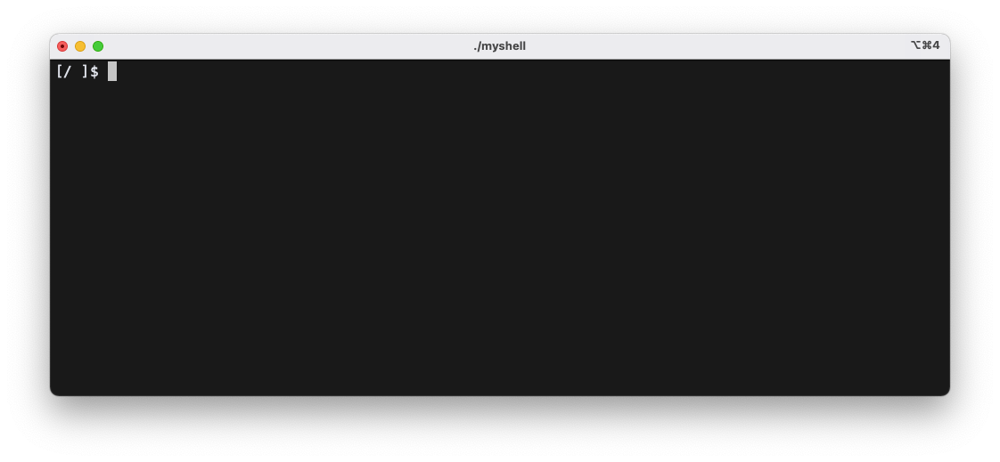

### Operation list

- default bash script, if operation does not start with "my" excute default bash script
  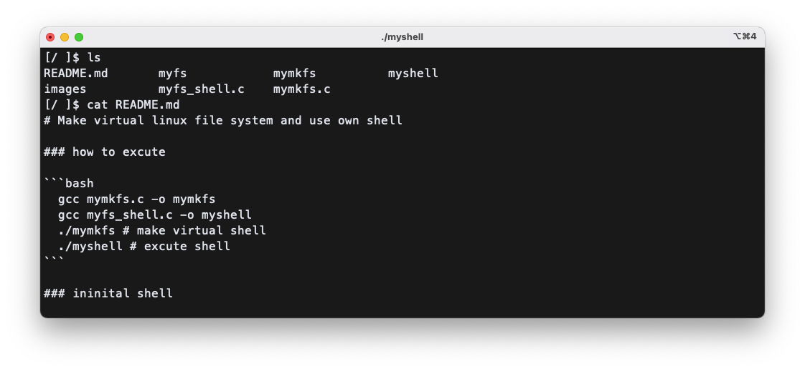
- mycpfrom: copy local file to virtual my files ystem.
- myls: show list virtual filesystem.
- mycat: show file's content.
  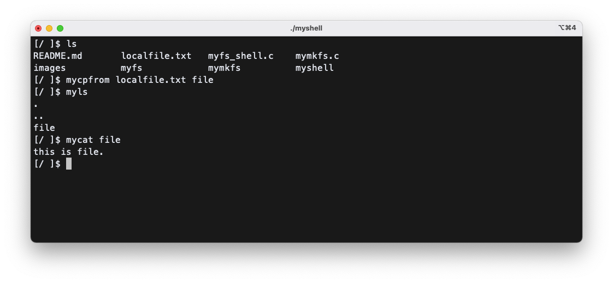
- mystate: show virtual system's info
  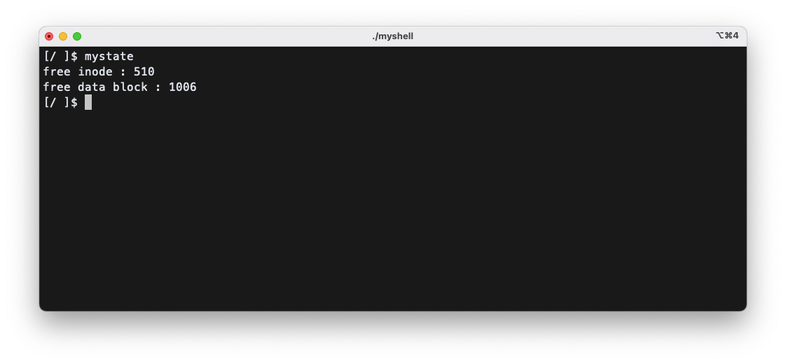
- myshowfile: show file's start byte ~ end byte
  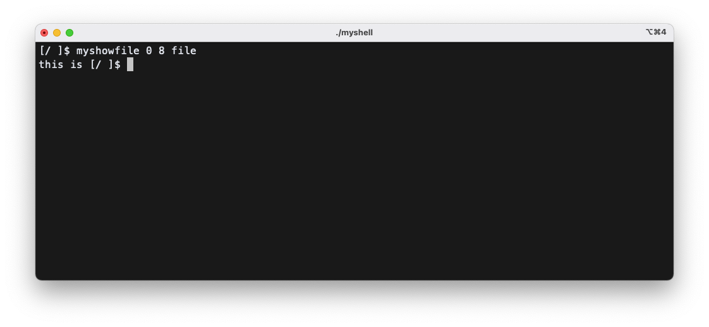
- mymkdir: make directory
- mycd: change directory
- mypwd: show current directory
  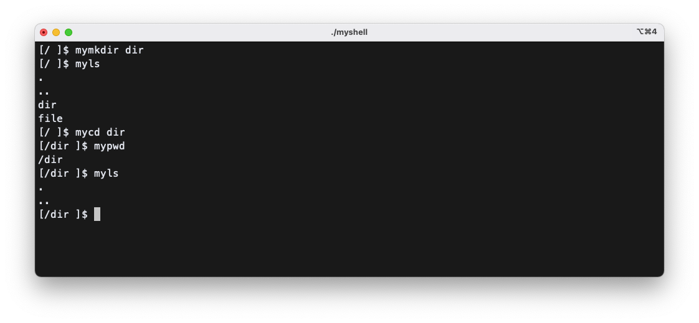
- myshowinode: show inode's detail
  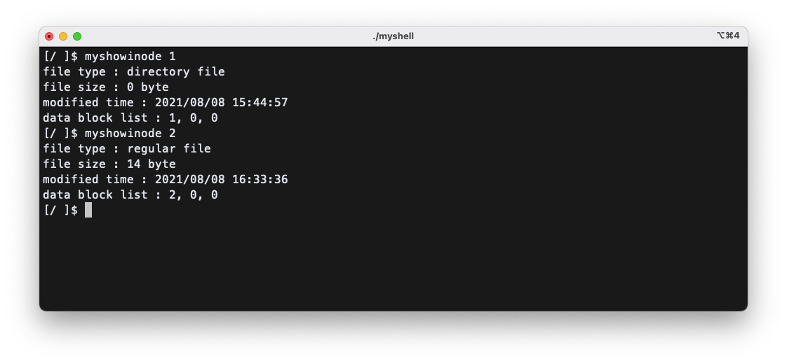
- myshowblock: show block's detail, if block is directory, show list file names, or block is regular file, show file's content
  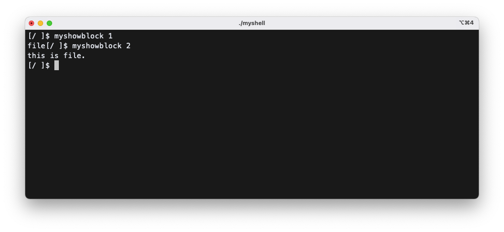
- mytouch: create empty file
  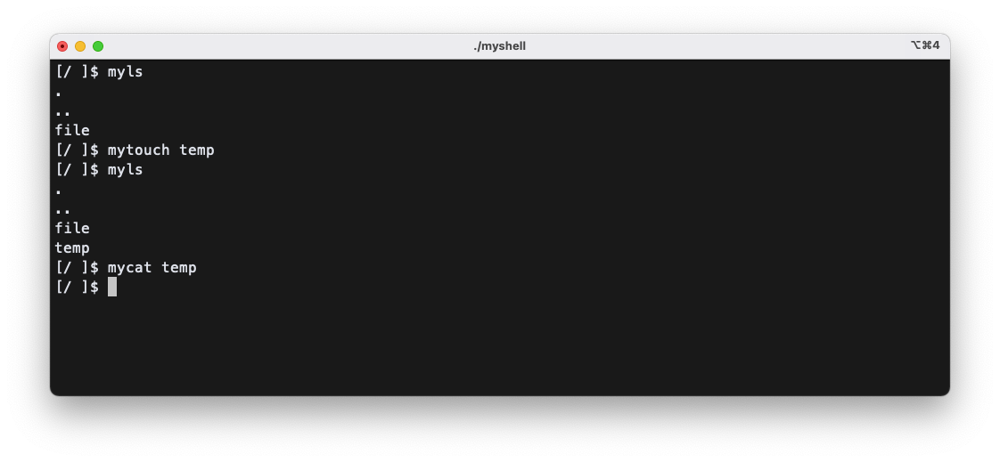
- mycpto: copy virtual file system's file to local file system
  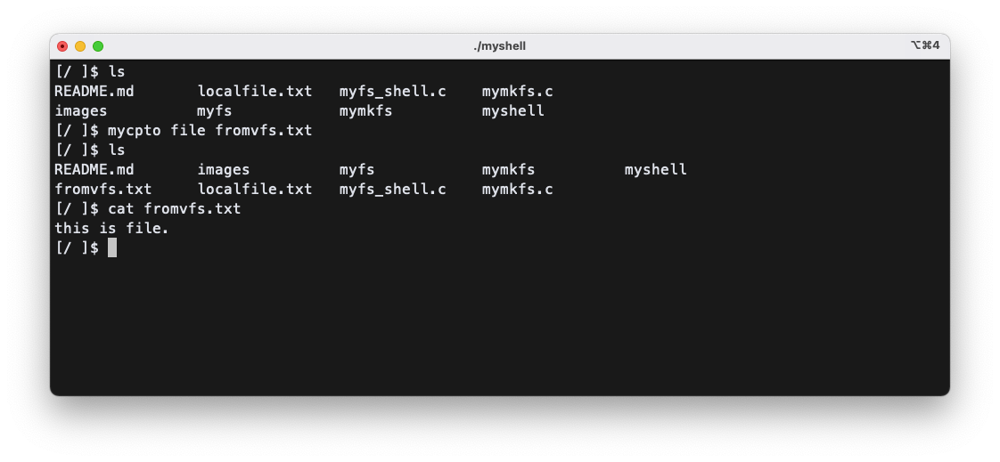
- mycp: copy file
  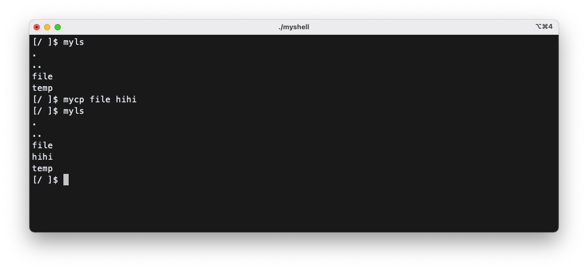
- mymv: move or rename file
  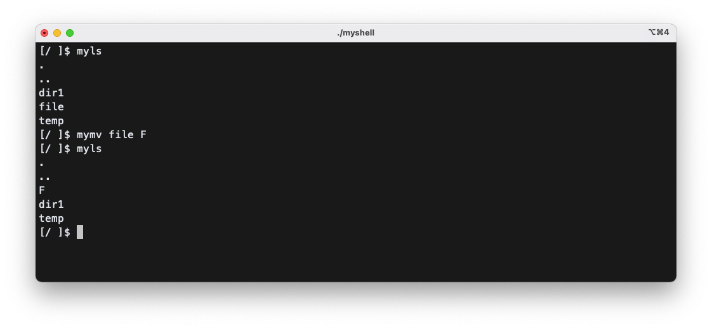
- myrm: remove file
  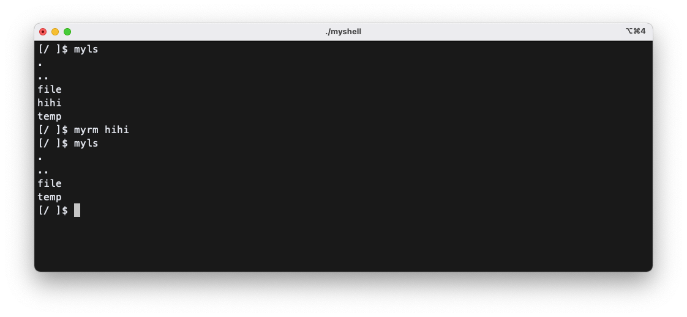
- myrmdir: remove directory
  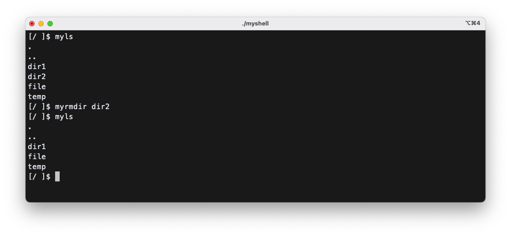
- mytree: show tree structure virtual file system
  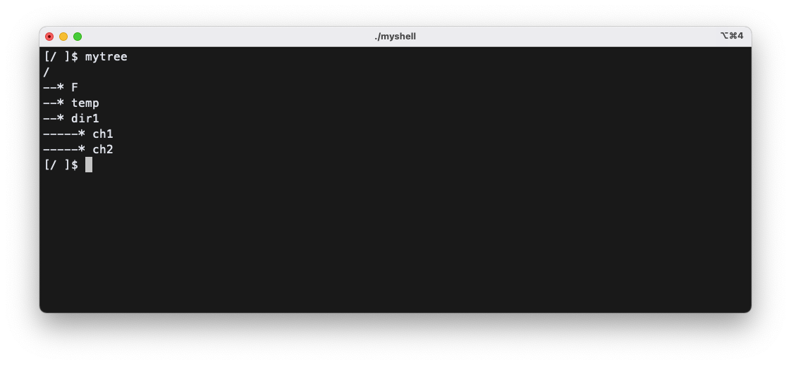
- exit, byebye: exit shell
  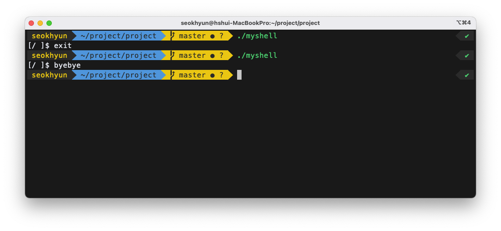
